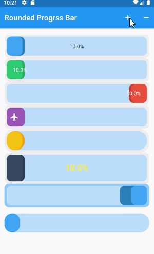
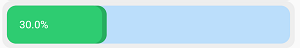
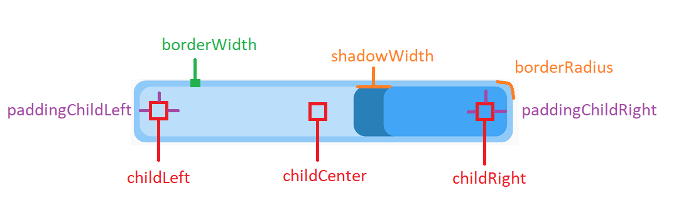
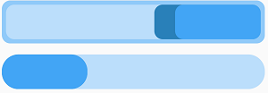
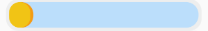
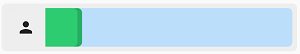

# Flutter Rounded Progressbar
Custom Progressbar



## Installing
add dependency in pubspec.yaml
```
dependencies:
  flutter_rounded_progress_bar: 0.1.1
```

## Usage
simple rounded progress bar.
```
RoundedProgressBar(
    childLeft: Text("$percent%",
        style: TextStyle(color: Colors.white)),
    percent: percent,
    theme: RoundedProgressBarTheme.green)
```


## Structure
Support Widget 3 position as childCenter , childLeft , childRight 



## customize 
use RoundedProgressBarStyle class
```
RoundedProgressBar(
    style: RoundedProgressBarStyle(
        widthShadow: 30, colorBorder: Colors.blue[200]),
    percent: percent,
    reverse: true,
),
RoundedProgressBar(
    style: RoundedProgressBarStyle(
        borderWidth: 0, 
        widthShadow: 0),
    margin: EdgeInsets.symmetric(vertical: 16),
    borderRadius: BorderRadius.circular(24),
    percent: percent,
),       
```


duration animation.
```
RoundedProgressBar(
    milliseconds:1000,
     percent: percent,
     theme: RoundedProgressBarTheme.yellow,
     borderRadius: BorderRadius.circular(24)),
```



## Theme
```
RoundedProgressBarTheme.blue, 
RoundedProgressBarTheme.red
RoundedProgressBarTheme.green
RoundedProgressBarTheme.purple
RoundedProgressBarTheme.yellow 
RoundedProgressBarTheme.midnight
```

## Icon Rounded Progressbar
Simple using icon.
```
IconRoundedProgressBar(
    icon: Padding(
        padding: EdgeInsets.all(8), child: Icon(Icons.person)),
    theme: RoundedProgressBarTheme.green,
    margin: EdgeInsets.symmetric(vertical: 16),
    borderRadius: BorderRadius.circular(6),
    percent: percent,
),
```


Custom background and icon.
```
IconRoundedProgressBar(
    widthIconSection: 70,
    icon: Padding(
        padding: EdgeInsets.all(8),
        child: Icon(Icons.airline_seat_flat, color: Colors.white)),
    style: RoundedProgressBarStyle(
        colorBackgroundIcon: Color(0xffc0392b),
        colorProgress: Color(0xffe74c3c),
        colorProgressDark: Color(0xffc0392b),
        colorBorder: Color(0xff2c3e50),
        backgroundProgress: Color(0xff4a627a),
        borderWidth: 4,
        widthShadow: 6),
    margin: EdgeInsets.symmetric(vertical: 16),
    borderRadius: BorderRadius.circular(6),
    percent: percent,
),
```

